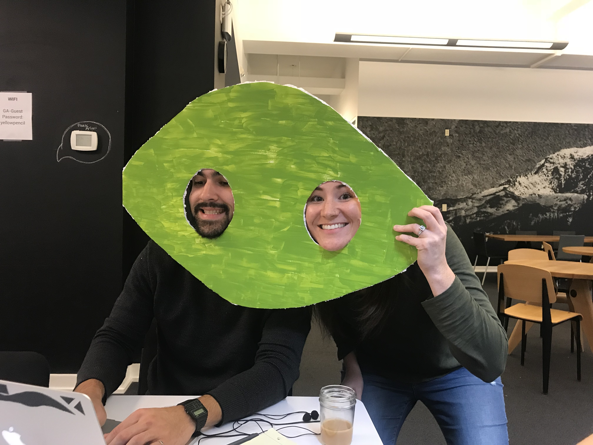
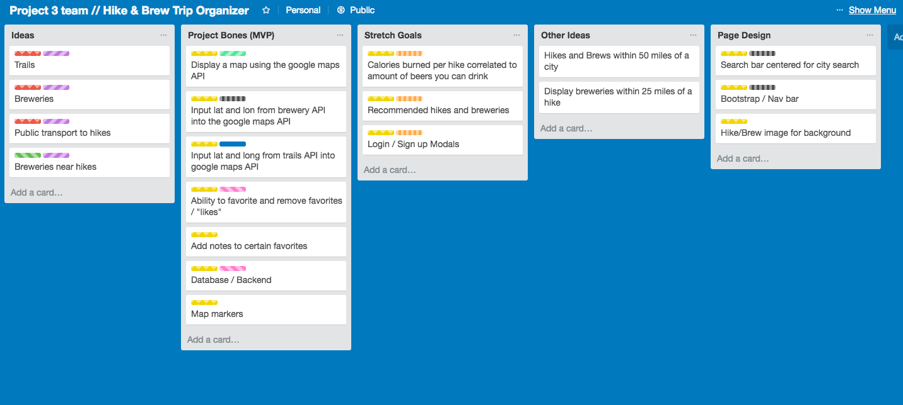
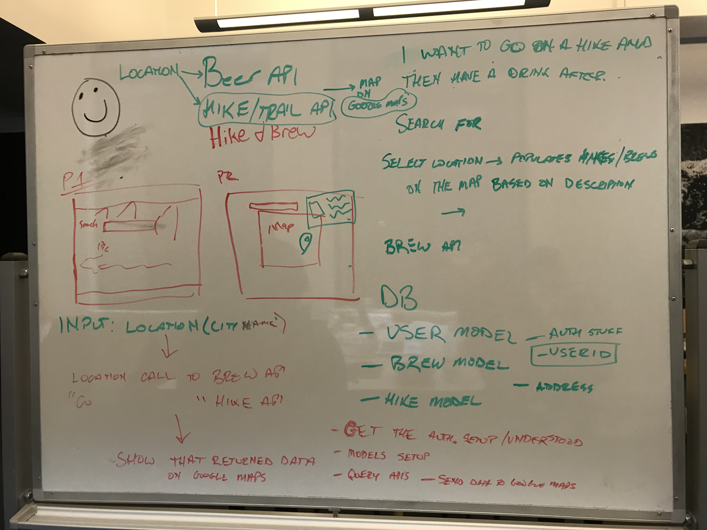
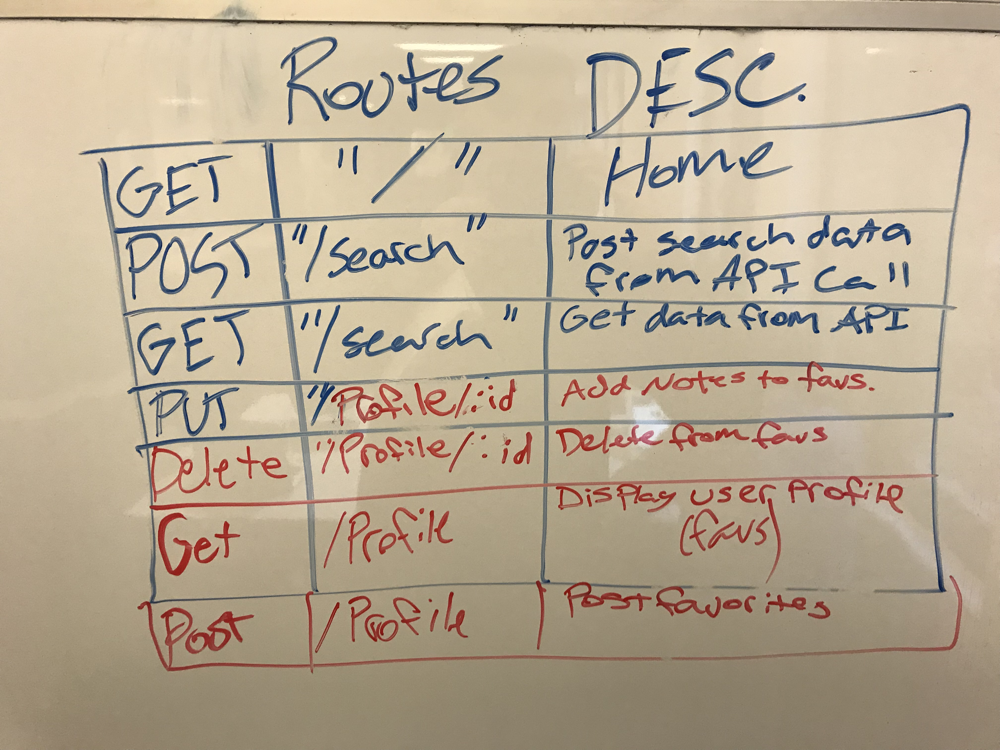
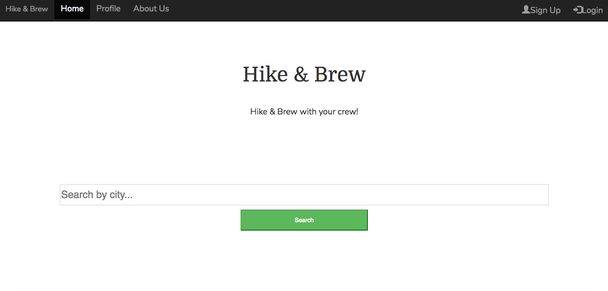

# hike-n-brew

## Day One

Erik - Worked on a layout for the page with bootstrap and studied the brewery API we are going to use to implement that.
 
Chase - Worked on implementation of the trail API.
 
Reggie - Worked on route and database functionality.
 
Tony - Worked on getting the google maps API up and running.
 

Team - We spent the majority of the morning brainstorming ideas and mapping things out for the rest of the project.

## Day Two

Erik - Focused on the brewery API for the first portion of the morning until we had to scrap our original API. Then worked on page layout.
 
Chase - Configuring map API.
 
Reggie - Configured map API and worked on the new brewery API.
 
Tony - Pair coding with Chase to try and fix the map API.
 
Team - Crushed a few goals and maintaining positive moral in order to get our MVP ready by Friday!

## Day Three

Erik - Setup the router and placed everything into its own route.
 
Chase - Configuring the brewery/trails API data to link with the google maps API.
 
Reggie - Converting brewery API data from street address to latitude and longitude so we are able to use it in our google maps API.
 
Tony - Setting map markers on the map related to the other APIs.
 
Team - Still feeling on track hoping to have an MVP by Friday.

##Day Four (we're still breathing)

Erik - Spent the day making the page responsive and adding a second fold to the front page.
 
Chase - Worked on responsive design and getting data to move between pages.
 
Reggie - API connectivity and pulling lat and lon for breweries throught the API.
 
Tony - Worked on getting markers to appear on the map and their design.
 
Team - On track to have MVP by day 5!
